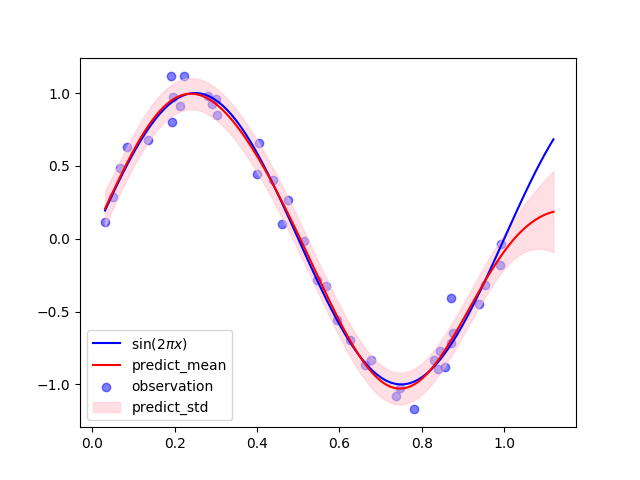
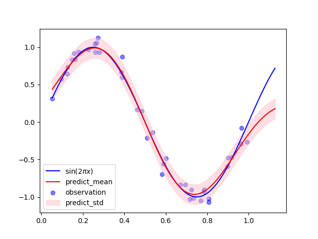

GPR
==
# ガウス過程回帰
- ガウス過程回帰を行うリポジトリ
- GPy ver.と numpy ver.を作成済み

# Discription
- 


# Installation
```
$ pip install -r requirements.txt
```

# Usage
```
$ python main.py --r (MyModel/GPR)
```

# Example
## Using GPy
```
$ python main.py --r GPR
```
If you do this command, you get the graph bellow


## Using only numpy
```
$ python main.py --r MyModel
```
If you do this command, you get the graph bellow
